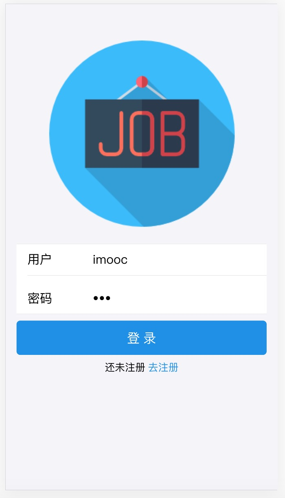

### 安装依赖：`yarn install`

### 启动：`yarn start`

### 打包：`yarn build`

### imooc招聘APP
一款招聘使用的app
####  react + react-redux + redux + react-router 4.x

### 服务端
#### koa2 + sockit.io + monogodb

Instead, it will copy all the configuration files and the transitive dependencies (Webpack, Babel, ESLint, etc) right into your project so you have full control over them. All of the commands except `eject` will still work, but they will point to the copied scripts so you can tweak them. At this point you’re on your own.

To learn React, check out the [React documentation](https://reactjs.org/).

This section has moved here: https://facebook.github.io/create-react-app/docs/troubleshooting#npm-run-build-fails-to-minify

### npm run eject
弹出配置文件，可以自定义配置webpack，单向操作，不可逆

### `yarn eject`

