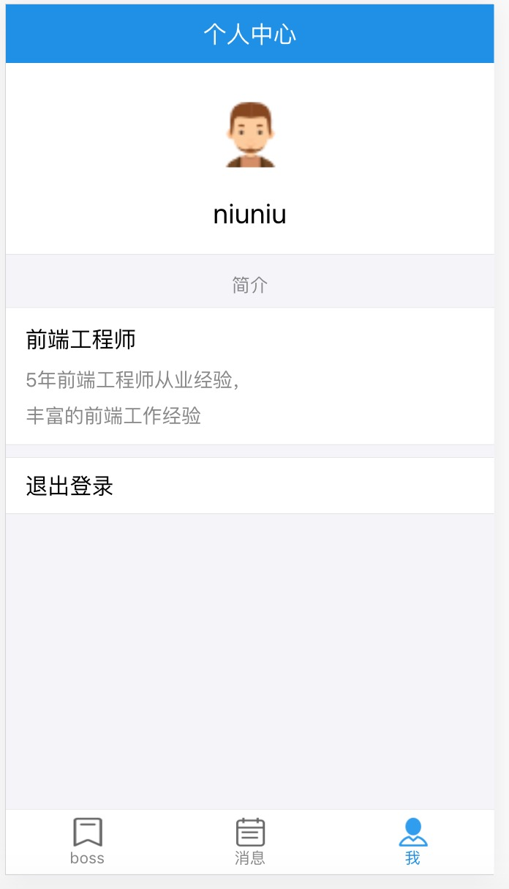

### imooc招聘APP
一款在线招聘app，有两种角色类型（boss和求职者）,根据不同的角色，显示不同的界面信息，支持在线聊天。。。

### 服务端
#### koa2 + socket.io + monogodb ＋ jsonwebtoken
### 客户端
#### react + react-redux + redux + react-router 4.x ＋ axios + socket.io-client + antd-mobile

### 项目启动
1.安装依赖：`yarn install`
2.启动：`yarn start`
3.打包：`yarn build`

### 项目总结
详情 见./React总结.md

### 项目预览

